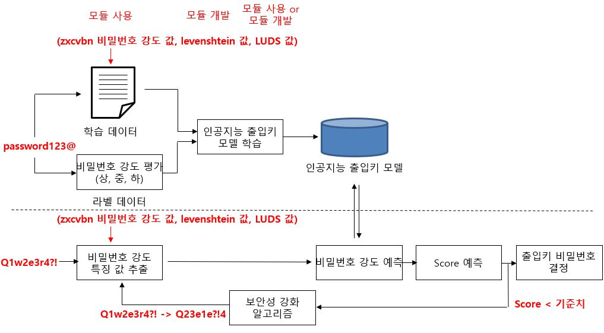

# Password_security_assessment

## 시스템 개발 구성도

## 참고자료
### zxcvbn 모듈 npm
- https://github.com/dropbox/zxcvbn

### levenshtein distance 구현 및 확인 필요
- https://hsp1116.tistory.com/41

### dumb password rules(멍청한 암호 규칙들?)
- https://github.com/dumb-password-rules/dumb-password-rules

### password 점수 사이트
- http://www.passwordmeter.com/
- https://www.security.org/how-secure-is-my-password/
- https://password.kaspersky.com/

### 한타를 영타로 바꿔주는 모듈(inko)
- https://github.com/738/inko

### chromedriver download
- https://chromedriver.chromium.org/downloads

### 10k-most-password
- https://github.com/iryndin/10K-Most-Popular-Passwords

### tensorflow.js
- https://opentutorials.org/course/4628
- https://www.npmjs.com/package/@tensorflow/tfjs
- https://www.npmjs.com/package/@tensorflow/tfjs-vis
- https://www.tensorflow.org/?hl=ko

### password data
- https://haveibeenpwned.com/PwnedWebsites
- 
